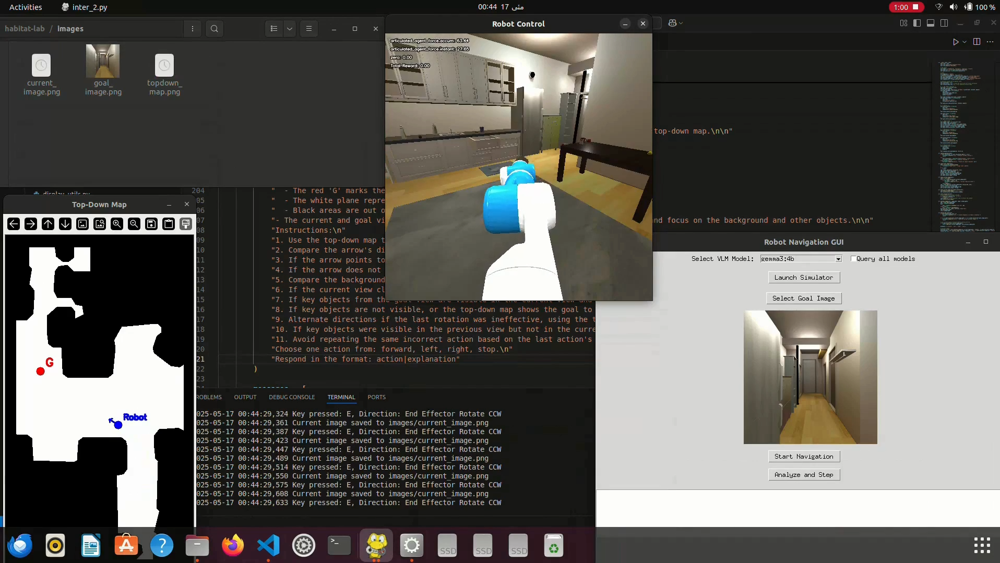

# Habitat-VLM-Navigation

A GUI-based robot navigation system using Habitat Lab and Vision-Language Models (VLMs). This project lets you launch a Habitat Lab simulator, select a goal image, fetch the current view from the simulator, and prompt a VLM (or a set of VLMs) to decide the next movement step. The robot then executes that command in the Habitat environment.  

---

## 📋 Table of Contents

1. [Overview](#overview)  
2. [Features](#features)  
3. [Demo](#demo)  
4. [Repository Structure](#repository-structure)  
5. [Prerequisites](#prerequisites)  
6. [Installation](#installation)  
7. [Usage](#usage)  
8. [VLM Prompt Details](#vlm-prompt-details)  
9. [Adding More Models / Customization](#adding-more-models--customization)  
10. [Contributing](#contributing)  
11. [License](#license)  

---

## 🧐 Overview

This project demonstrates how to integrate Habitat Lab (a photorealistic 3D simulator) with a Tkinter-based GUI and state-of-the-art Vision-Language Models (VLMs) (e.g., Gemma3, MiniCPM-v, BakLLava, Llava) to perform vision-driven navigation in a 3D environment. The user can:

1. **Launch** a Habitat Lab simulator (PointNav task).  
2. **Select** a static goal image (PNG/JPEG).  
3. **Fetch** the current camera view from Habitat for the robot’s current location.  
4. **Prompt** one or more VLMs with “previous → current → goal” image triplets to decide whether to rotate, reverse, or move forward.  
5. **Send** the VLM’s command to Habitat Lab via a simple text file (`images/command.txt`).  
6. **Update** the GUI with the new current view after each step.

This approach allows researchers, developers, and hobbyists to quickly prototype vision-driven navigation logic and experiment with different VLMs (or an ensemble of VLMs) to compare performance and robustness.

---

## ✨ Features

- **Cross-Model Selection**  
  - Dropdown to select among four pretrained VLMs:  
    - Gemma3 (4B)  
    - MiniCPM-v  
    - BakLLava  
    - Llava  

- **Ensemble / Voting Mode**  
  - A checkbox (“Query all models”) to simultaneously query all four VLMs.  
  - Performs majority voting across model outputs to choose the final movement.  

- **Adaptive Prompting**  
  - Reasoning over *three* frames:  
    1. **Previous** (one step ago)  
    2. **Current** (just fetched)  
    3. **Goal** (static user-provided)  
  - VLM logic:  
    1. If visible objects in the goal image are missing from *both* previous and current frames, rotate (CW or CCW) until there’s a semantic overlap.  
    2. If goal objects appeared in the previous frame but not in current, reverse the last step.  
    3. Otherwise, advance forward.  

- **Tkinter GUI**  
  - Buttons for:  
    - Launching the simulator  
    - Selecting goal image  
    - Starting navigation (fetch current image)  
    - Analyzing & stepping (prompt VLM → send command → refresh image)  
  - Canvas fields for displaying “Current” and “Goal” images side by side.  
  - Embedded text box to show VLM(s) output “`action|explanation`”.  

- **Habitat Lab Integration**  
  - Subprocess spawns `inter_2.py`, which:  
    - Loads Habitat’s “PointNav” config  
    - Spawns the robot agent in the environment  
    - Continuously writes out `images/current.jpg` whenever a new frame is requested  
    - Reads `images/command.txt` and executes the movement (forward, left, right, rotation, etc.)

---

## 🎬 Demo

### Static Screenshots

1. **GUI Startup (Model Selection)**  
   

2. **Selecting a Goal Image**  
   

3. **Fetched Current View**  
   

4. **VLM Response & Command Issued**  
   

5. **Simulated Robot Movement**  
   

---

### Short Video Walkthrough

<details>
  <summary>▶️ Click to expand video demo (highlights end-to-end flow)</summary>

  <!-- Replace with your actual video file path or a link to YouTube/GitHub release -->
  <video width="640" height="360" controls>
    <source src="https://youtu.be/HgwTckcfxbg" type="video/mp4">
    Your browser does not support the video tag.
  </video>
</details>

---

## 🛠 Prerequisites

1. **Operating System**  
   - Ubuntu 20.04 (or any Linux distribution compatible with Habitat Lab)  
   - (macOS support experimental; Windows not officially supported)

2. **Python**  
   - Python 3.8 or newer  
   - A working `virtualenv` or `conda` environment is recommended  

3. **Dependencies**  
   - `habitat-lab` (PointNav benchmark)  
   - `Pillow` (PIL)  
   - `tkinter` (should come with most Python installs)  
   - `ollama` Python client (for querying VLMs)  
   - `torch` / `transformers` (if your local environment uses any PyTorch-based VLMs)
  
   
---

## 🚀 Installation

1. **Clone the Repository**

   ```bash
   git clone https://github.com/<your-username>/Habitat-VLM-Navigation.git
   cd Habitat-VLM-Navigation

2. **Create & Activate Virtual Environment**

```bash

python3 -m venv venv
source venv/bin/activate
```

3. ** Install Python Packages**

```bash

pip install --upgrade pip
pip install -r requirements.txt
```
Contents of requirements.txt:

```bash

pillow
ollama
habitat-lab
torch           # (if needed for your VLMs)
```
4. **Set Up Habitat Lab**

Follow the official Habitat Lab installation guide to install & configure dependencies (e.g., habitat-sim, pytorch, etc.). Make sure you can run a basic PointNav example before proceeding.

5. **Verify Folder Structure**

```bash
tree .
```

## 🎮 Usage

### 1. Launch Habitat Lab Simulator

From the root folder, run:

```bash
python test3.py
```

* This will open the GUI window.

* Click **“Launch Simulator”** to spawn `inter_2.py` in a subprocess. Habitat will start and begin writing `images/current.jpg` once the agent is ready.

### 2. Select a Goal Image

* Click **“Select Goal Image”** and choose a PNG/JPEG snapshot of the target you want the robot to navigate toward.
* The goal image will display on the right canvas.

### 3. Start Navigation

* Click **“Start Navigation”**.

  * This will fetch the first “current” frame (agent’s initial camera view) from `images/current.jpg`, copy it as `images/previous.jpg`, and display it on the left canvas.

### 4. Analyze and Step

* With both **Current** and **Goal** images loaded, click **“Analyze and Step”**.

  * The GUI will:

    1. Copy the existing `current.jpg` → `previous.jpg`.
    2. Build a prompt referencing Previous, Current, and Goal images.
    3. Query your selected VLM (or all VLMs if “Query all models” is checked).
    4. Receive `action|explanation` from the VLM(s).
    5. Display the combined response in the text box.
    6. Write the chosen `action` (e.g., “forward”, “left”) to `images/command.txt`.
    7. Wait \~1.5 s for `inter_2.py` to execute the movement and produce a new `current.jpg`.
    8. Fetch and display the updated `current.jpg`.

* Repeat **“Analyze and Step”** to continue navigating step by step until the robot reaches the goal.


## 🧠 VLM Prompt Details

The built-in prompt in `test3.py` uses this logic on each step:

1. **Rotate if Misaligned**

   * If objects/features in the **Goal** are not visible in **Previous** or **Current**, the robot is likely facing away.
   * VLM should respond with either `left` or `right` (i.e., rotate clockwise or counterclockwise) until a portion of the goal scene is visible.

2. **Reverse on Wrong Move**

   * If features from the **Goal** appeared in the **Previous** frame but are missing in **Current**, the VLM’s last step was incorrect.
   * VLM should respond with `reverse` (or analogous) to step back, then remember this reversal for subsequent reasoning.

3. **Otherwise Move Forward**

   * If the above conditions don’t hold—i.e., the agent is roughly oriented toward the goal—move forward (`forward`).

4. **Format**

   * The VLM must reply with a single action token (`forward`, `left`, `right`, `stop`) followed by a pipe (`|`) and a brief explanation (e.g., `"left|rotating to find overlap with goal objects"`).

---

## ➕ Adding More Models / Customization

* **To add a new VLM**:

  1. Install or configure it (e.g., add its package or API credentials).
  2. Append its identifier to `self.models` in `test3.py`.
  3. Ensure that `ollama.chat(model=<your_model>, …)` can query it.

* **Customizing the Prompt**:

  * Edit the `prompt` string in `analyze_and_step()` to add domain‐specific reasoning or additional constraints (e.g., obstacle avoidance, distance estimation).

* **Logging & Debugging**:

  * Insert print statements or write a simple logger around `ollama.chat()` calls to track raw prompt/response pairs.
  * Inspect `images/command.txt` and `images/current.jpg` to confirm proper I/O between the GUI and `inter_2.py`.

---

## 📄 License

This project is licensed under the [MIT License](LICENSE). See the LICENSE file for details.

---

> **Note:** This is a research‐oriented prototype. Use it at your own risk. Habitat Lab may require additional GPU/GPU‐driver setups. For more details, check [Habitat Lab documentation](https://github.com/facebookresearch/habitat-lab).


